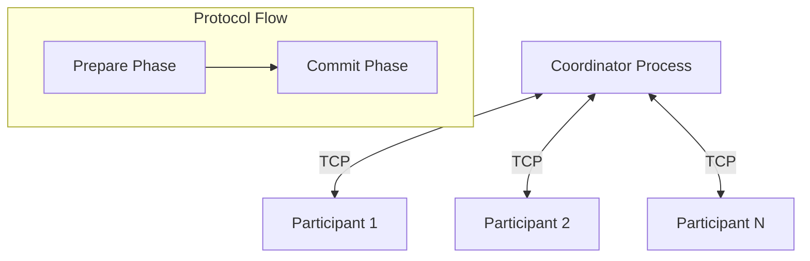

# Design Document

## Overview

This design implements a two-phase commit (2PC) protocol using Python processes communicating via TCP sockets. The system consists of a coordinator process that orchestrates the protocol and multiple participant processes that vote on protocol outcomes. Each participant starts with a non-deterministic vote preference, and the system ensures correctness guarantees are maintained throughout the protocol execution.

## Architecture

### High-Level Architecture



### Process Architecture

**Coordinator Process:**
- TCP server accepting participant connections
- Protocol state machine managing 2PC phases
- Connection manager for participant lifecycle
- Message router for protocol messages
- Logging and monitoring subsystem

**Participant Process:**
- TCP client connecting to coordinator
- Vote preference generator (non-deterministic)
- Message handler for protocol requests
- Response generator for coordinator messages
- Connection management with timeout handling

## Components and Interfaces

### Core Components

#### 1. Message System
```python
class Message:
    message_type: MessageType
    transaction_id: str
    payload: dict
    timestamp: float

class MessageType(Enum):
    PREPARE = "prepare"
    VOTE_COMMIT = "vote_commit"
    VOTE_ABORT = "vote_abort"
    COMMIT = "commit"
    ABORT = "abort"
    ACK = "ack"
```

#### 2. Coordinator Components

**ConnectionManager:**
- Manages TCP server socket
- Handles participant connection lifecycle
- Maintains active connection registry
- Implements connection health monitoring

**ProtocolEngine:**
- Implements 2PC state machine
- Validates correctness conditions
- Manages protocol timeouts
- Coordinates phase transitions

**MessageHandler:**
- Serializes/deserializes protocol messages
- Routes messages to appropriate handlers
- Implements message acknowledgment
- Handles message ordering

#### 3. Participant Components

**VotePreferenceGenerator:**
- Generates non-deterministic vote preference on startup
- Maintains consistent preference throughout protocol instance
- Supports configurable probability distribution

**ProtocolClient:**
- Manages TCP connection to coordinator
- Implements protocol message handling
- Handles connection failures and reconnection
- Manages protocol timeouts

### Interface Specifications

#### TCP Communication Protocol
- **Port Configuration:** Coordinator listens on configurable port (default: 8080)
- **Message Format:** JSON-serialized messages with length prefix
- **Connection Management:** Persistent connections with heartbeat mechanism
- **Error Handling:** Graceful connection cleanup and retry logic

#### Protocol Message Flow
1. **Connection Phase:** Participants connect to coordinator
2. **Prepare Phase:** Coordinator sends PREPARE, participants respond with VOTE_COMMIT/VOTE_ABORT
3. **Decision Phase:** Coordinator sends COMMIT/ABORT based on votes
4. **Acknowledgment Phase:** Participants send ACK for final decision

## Data Models

### Protocol State Management

```python
class ProtocolState(Enum):
    INIT = "init"
    WAITING_FOR_PARTICIPANTS = "waiting_for_participants"
    PREPARE_PHASE = "prepare_phase"
    COMMIT_PHASE = "commit_phase"
    COMPLETED = "completed"
    ABORTED = "aborted"

class ParticipantState(Enum):
    CONNECTED = "connected"
    VOTED = "voted"
    ACKNOWLEDGED = "acknowledged"
    DISCONNECTED = "disconnected"
```

### Configuration Models

```python
class CoordinatorConfig:
    port: int = 8080
    expected_participants: int
    timeout_seconds: int = 30
    log_level: str = "INFO"
    enable_dynamic_joining: bool = False

class ParticipantConfig:
    coordinator_host: str = "localhost"
    coordinator_port: int = 8080
    vote_preference: Optional[bool] = None  # None = random
    timeout_seconds: int = 30
    log_level: str = "INFO"
```

## Error Handling

### Failure Scenarios and Responses

#### Coordinator Failures
- **Participant Connection Loss:** Mark participant as disconnected, continue with remaining participants if minimum threshold met
- **Network Timeouts:** Implement exponential backoff for retries
- **Protocol State Corruption:** Log error and abort protocol instance

#### Participant Failures
- **Coordinator Connection Loss:** Attempt reconnection with exponential backoff
- **Message Timeout:** Log timeout and notify coordinator of unavailability
- **Invalid Message Received:** Log error and send error response to coordinator

#### Network Failures
- **Message Loss:** Implement message acknowledgment and retry mechanism
- **Connection Drops:** Automatic reconnection with connection state recovery
- **Partial Network Partition:** Timeout-based failure detection

### Correctness Guarantees Implementation

#### Commit Safety Validation
```python
def validate_commit_decision(votes: List[Vote]) -> bool:
    """Ensure all participants voted commit before sending commit decision"""
    return all(vote.decision == VoteDecision.COMMIT for vote in votes)
```

#### Abort Safety Validation
```python
def validate_abort_decision(votes: List[Vote]) -> bool:
    """Ensure at least one participant voted abort before sending abort decision"""
    return any(vote.decision == VoteDecision.ABORT for vote in votes)
```

## Testing Strategy

### Unit Testing
- **Message Serialization/Deserialization:** Verify correct JSON encoding/decoding
- **Protocol State Machine:** Test all state transitions and edge cases
- **Vote Preference Generation:** Validate randomness and consistency
- **Connection Management:** Test connection lifecycle and cleanup

### Integration Testing
- **Coordinator-Participant Communication:** End-to-end message flow testing
- **Protocol Execution:** Complete 2PC protocol with various vote combinations
- **Failure Recovery:** Network failures, process crashes, and timeout scenarios
- **Correctness Validation:** Verify safety guarantees under various conditions

### System Testing
- **Multi-Participant Scenarios:** Test with different numbers of participants (2-10)
- **Concurrent Protocol Instances:** Multiple protocol executions simultaneously
- **Performance Testing:** Latency and throughput under load
- **Stress Testing:** Resource exhaustion and recovery scenarios

### Test Scenarios
1. **Happy Path:** All participants vote commit
2. **Abort Scenario:** One or more participants vote abort
3. **Participant Failure:** Participant disconnects during prepare phase
4. **Participant Failure:** Participant disconnects during commit phase
5. **Coordinator Failure:** Coordinator crashes and recovers
6. **Network Partition:** Temporary network connectivity issues
7. **Timeout Scenarios:** Various timeout conditions
8. **Correctness Validation:** Verify safety guarantees are maintained

## Implementation Considerations

### Performance Optimizations
- **Concurrent Message Handling:** Use asyncio for non-blocking I/O operations
- **Connection Pooling:** Reuse TCP connections for multiple protocol instances
- **Message Batching:** Group related messages to reduce network overhead
- **Efficient Serialization:** Optimize JSON serialization for large message volumes

### Security Considerations
- **Input Validation:** Validate all incoming messages for proper format and content
- **Connection Authentication:** Basic participant identification (extensible for future auth)
- **Resource Limits:** Prevent resource exhaustion attacks
- **Logging Security:** Avoid logging sensitive information

### Monitoring and Observability
- **Protocol Metrics:** Success/failure rates, latency distributions
- **Connection Metrics:** Active connections, connection churn
- **Error Metrics:** Error rates by type and component
- **Performance Metrics:** Message throughput, processing latency

### Configuration Management
- **Environment Variables:** Support configuration via environment variables
- **Configuration Files:** YAML/JSON configuration file support
- **Command Line Arguments:** Override configuration via CLI arguments
- **Validation:** Comprehensive configuration validation on startup